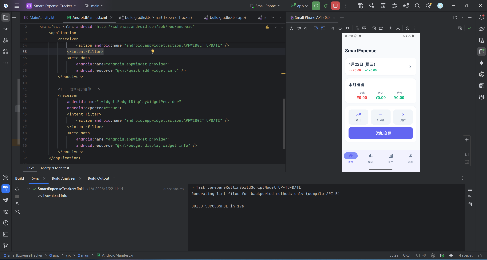
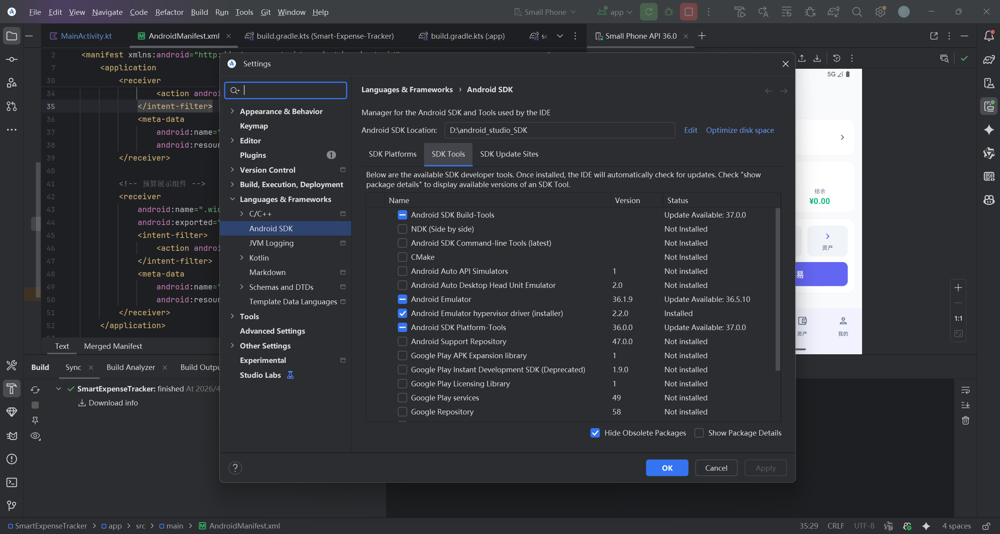
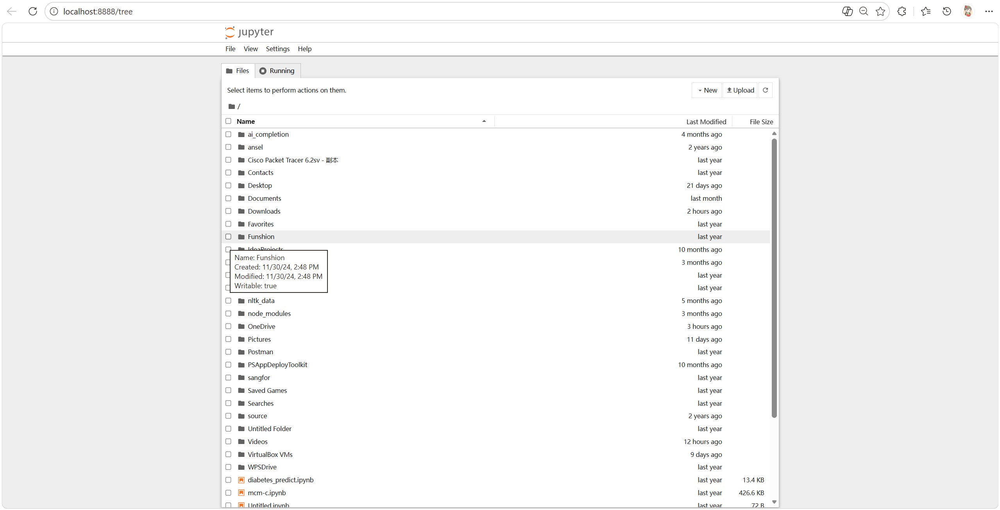
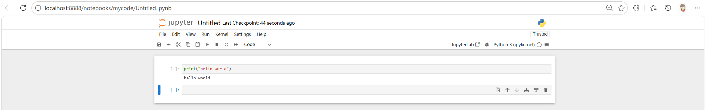
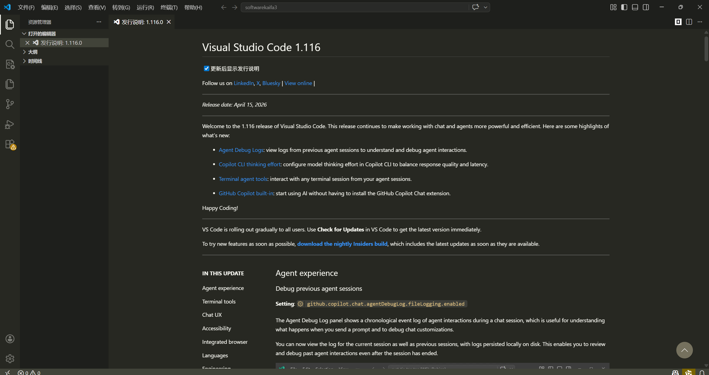
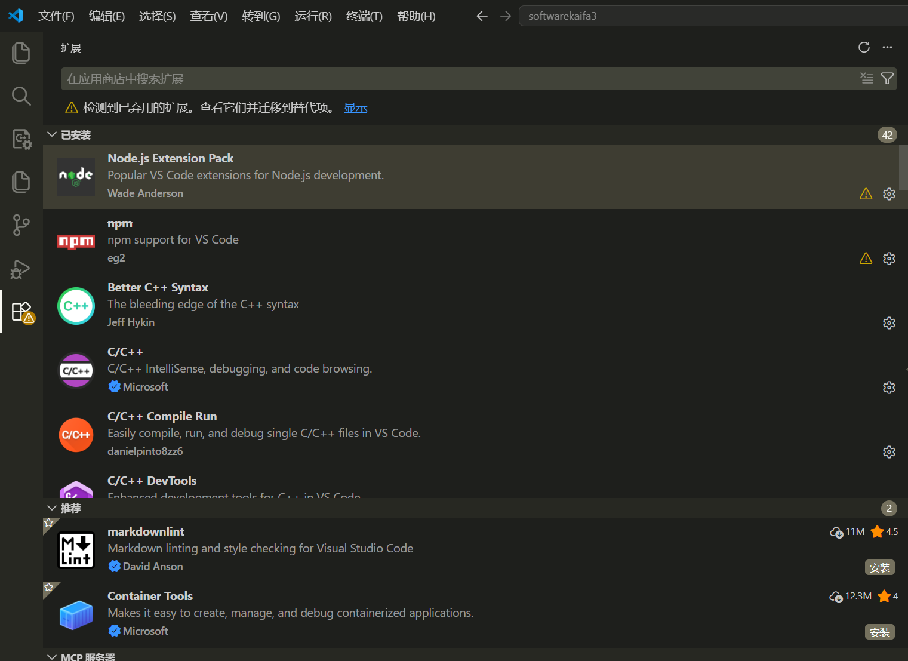

# 实验一：Android Studio、Jupyter Notebook 及 VS Code 环境安装验证报告

## 1. Android Studio 安装结果
**安装版本**：Android Studio (2024.2.1)（满足 LiteRT 支持的 4.1+ 要求）  
**安装路径**：`D:\android_studio`  
**验证状态**：安装成功，SDK Manager 显示 Android SDK 已配置，支持 LiteRT 开发。

> **安装截图验证（成功运行记账助手项目）**
> 
> 

> **SDK 配置截图**
> 
> 

## 2. Jupyter Notebook 与 Python 环境安装结果
**Python 版本**：Python 3.10+  
**安装工具**：Anaconda  
**验证状态**：安装成功，Jupyter Notebook 服务可正常启动，Python 内核已注册。

> **浏览器界面截图**
> 
> 

> **Python 代码执行验证**
> 
>

## 3. Visual Studio Code 安装结果
**安装版本**：Visual Studio Code 1.116  
**安装路径**：`D:\VSCode`  
**验证状态**：安装成功，主界面可正常打开，插件市场可访问。

> **VS Code 主界面截图**
> 
> 

> **插件市场截图**
> 
> 

## 4. 总结
以上三个核心开发工具均已成功安装并验证可用，满足后续进行 LiteRT 模型集成、Python 机器学习建模以及代码编辑的开发环境要求。
